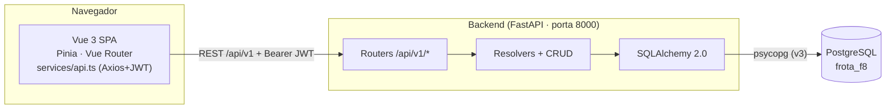
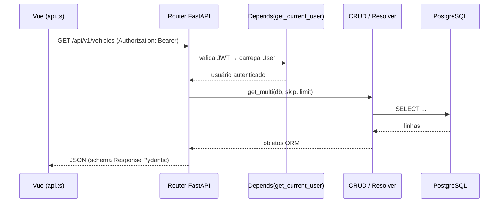
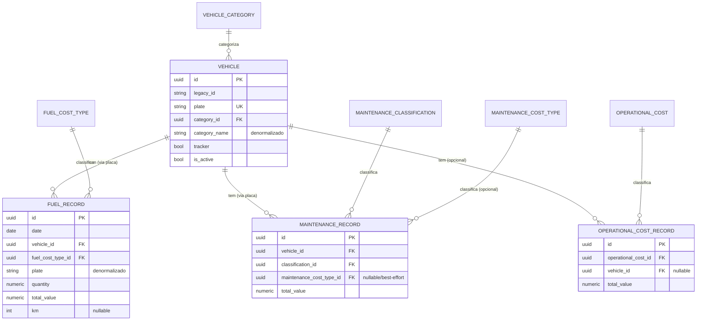
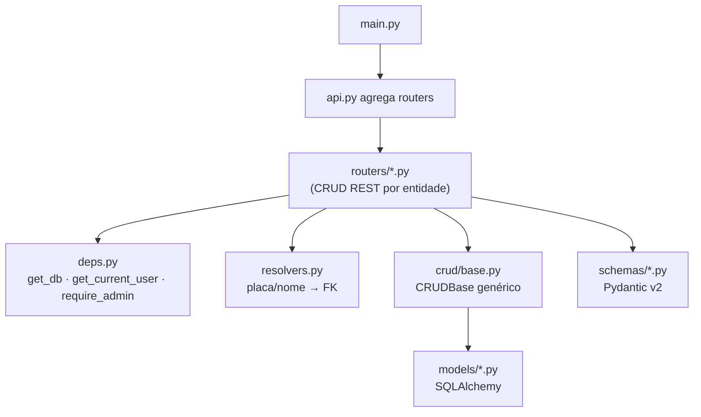
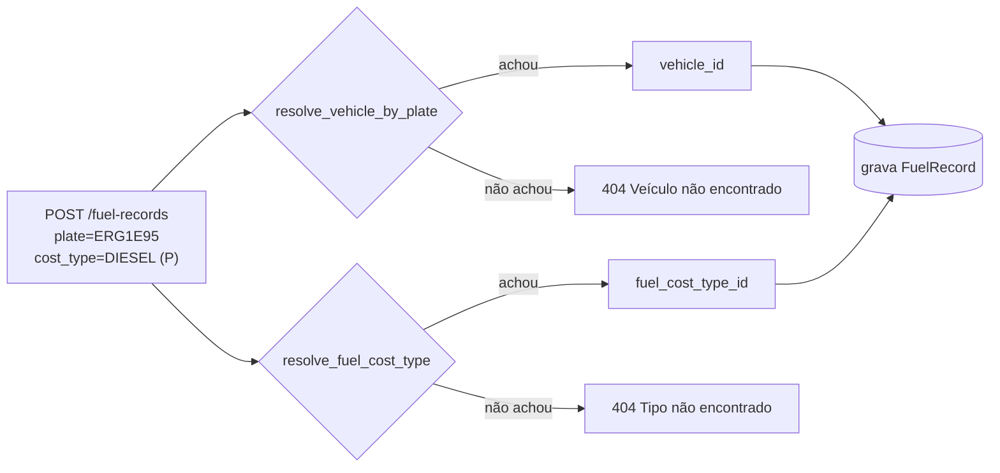
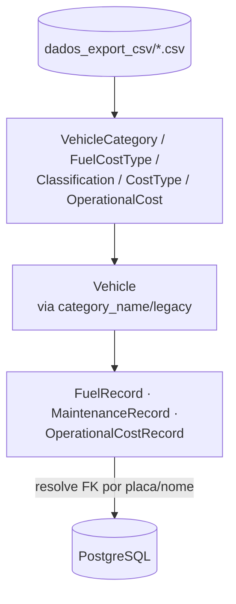
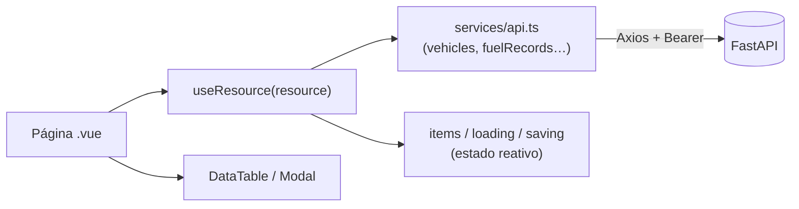
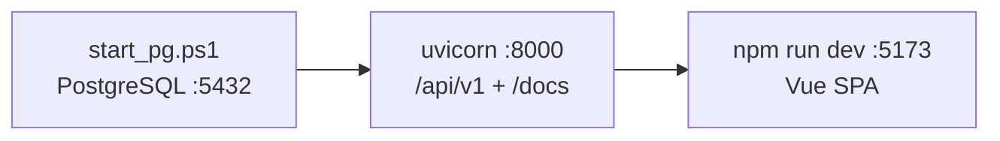

# Frota F8 — Documentação Arquitetural e Funcional

Sistema de **controle de frota** migrado da plataforma low-code **Base44 (BaaS)** para
uma stack própria, eliminando vendor lock-in e dando controle total da infraestrutura.

- [1. Visão geral](#1-visão-geral)
- [2. Stack e decisões](#2-stack-tecnológica-e-por-quê)
- [3. Arquitetura do sistema](#3-arquitetura-do-sistema)
- [4. Modelo de dados](#4-modelo-de-dados)
- [5. Decisões orientadas pelos dados](#5-decisões-orientadas-pelos-dados)
- [6. Backend (FastAPI)](#6-backend-fastapi)
- [7. Autenticação e segurança](#7-autenticação-e-segurança)
- [8. Migração de dados (importador)](#8-migração-de-dados-importador)
- [9. Frontend (Vue 3)](#9-frontend-vue-3)
- [10. Infraestrutura e execução](#10-infraestrutura-e-execução)
- [11. Estado e roadmap](#11-estado-da-migração-e-roadmap)

---

## 1. Visão geral

O Base44 modelava as entidades como **JSON Schema** (`.jsonc`) e cuidava de banco,
API e autenticação. A migração recria essas três camadas com tecnologia aberta:

| Antes (Base44) | Depois (stack própria) |
|----------------|------------------------|
| Banco gerenciado (IDs opacos) | **PostgreSQL** (auto-hospedado) |
| SDK `@base44/sdk` no frontend | **API REST FastAPI** própria |
| Entidades em JSON Schema | **SQLAlchemy 2.0 + Pydantic v2** |
| Autenticação do Base44 | **JWT próprio** (bcrypt + tokens) |
| Frontend React | **Vue 3** (migração em andamento) |

**Funcionalmente**, o sistema controla: veículos da frota e suas categorias;
lançamentos de **abastecimento**, **manutenção** e **custos operacionais**; e as
tabelas de apoio (tipos de custo, classificações). Cada lançamento se liga a um
veículo e a um tipo de custo, com dashboards de totais por módulo.

---

## 2. Stack tecnológica e por quê

| Camada | Tecnologia | Motivo |
|--------|-----------|--------|
| Banco | PostgreSQL 16 | Relacional robusto, tipos nativos (UUID, NUMERIC), open source |
| ORM | SQLAlchemy 2.0 (`Mapped`/`mapped_column`) | Tipagem estática, padrão de mercado |
| Validação | Pydantic v2 | Validação declarativa e serialização da API |
| API | FastAPI | Async, OpenAPI/Swagger automático, DI nativa |
| Migrations | Alembic | Versionamento de schema |
| Auth | python-jose (JWT) + bcrypt | Sem dependência externa de identidade |
| Frontend | Vue 3 + Vite + TypeScript | Migração do React; DX moderna |
| Estado/Rotas | Pinia + Vue Router | Padrão do ecossistema Vue |
| HTTP | Axios | Interceptors para JWT |
| Estilo | Tailwind CSS | Reaproveita a linguagem visual (shadcn) do React |

> Nota: trocamos `passlib` por **bcrypt direto** — o passlib 1.7.4 é incompatível
> com bcrypt 4.x (erro ao ler a versão do módulo).

---

## 3. Arquitetura do sistema

Três camadas independentes, comunicando por HTTP/JSON:



O fluxo de uma requisição autenticada:



---

## 4. Modelo de dados

10 entidades de domínio + `User`. Toda entidade migrada do Base44 herda o
**`Base44Mixin`**: `id` (UUID, PK), `legacy_id` (id original de 24 chars do Base44,
para conferência), `created_by` (e-mail), `created_at`, `updated_at`.



**Tipos de coluna** (deduzidos dos dados reais):

- `total_value`, `quantity` → `Numeric` (dinheiro/decimais).
- `km` → `Integer` **nullable** (vem vazio com frequência: 749/1288 em abastecimentos).
- `date` → `Date` (data pura); `created_at`/`updated_at` → `DateTime(timezone=True)`.
- `is_active`, `tracker` → `Boolean` com default.
- `unit` (abastecimento) → `String` com default `LT` (enum LT/UN validado no Pydantic).

---

## 5. Decisões orientadas pelos dados

Antes de codar, os CSVs exportados foram **auditados**. Achados que definiram o schema:

1. **A placa é o elo real, não o `category_id`.** No Base44 os lançamentos guardavam
   `category_id`, mas ele vinha **vazio em 97,6%** dos abastecimentos. Já a `plate`
   é 100% íntegra em todos os lançamentos → a FK `vehicle_id` é deduzida **pela placa**.

2. **Chave primária híbrida de identidade.** PK nova em **UUID** (idiomática no
   Postgres) + coluna **`legacy_id`** preservando o id de 24 chars do Base44, apenas
   para conferência/rastreabilidade pós-migração.

3. **Relacionamento híbrido (FK + string).** Adicionamos FKs reais **e** mantivemos as
   colunas de texto denormalizadas (`category_name`, `vehicle_model`, `plate`…) que o
   frontend já consumia. Integridade garantida sem quebrar as telas na transição.

4. **FK obrigatória só onde há 100% de integridade.** Verificado na auditoria:
   - Enforced (NOT NULL): Vehicle→Categoria, Fuel→FuelCostType, Maint→Classification,
     OperationalRecord→OperationalCost, e `vehicle_id` via placa.
   - **Best-effort (nullable)**: Maint→MaintenanceCostType casa só ~91% (33/381 por
     variações de grafia, ex. "TROCA DE OLEO" vs "ÓLEO"). Fica nula quando não há
     combinação exata, sem perder os campos de texto.

5. **`User` nasce do zero.** Não há CSV de usuários (o Base44 controlava o login);
   o admin inicial é semeado a partir do `.env`.

> Essas mesmas regras de religação vivem em dois lugares espelhados:
> [`app/api/resolvers.py`](../backend/app/api/resolvers.py) (na API, ao criar/editar) e
> [`scripts/migrate_csv.py`](../backend/scripts/migrate_csv.py) (na importação).

---

## 6. Backend (FastAPI)

### Organização em camadas

```
backend/app/
  core/       config (pydantic-settings), database (engine/Session), security (JWT/bcrypt)
  models/     SQLAlchemy 2.0 — 1 arquivo por entidade + base.py (mixins)
  schemas/    Pydantic v2 — Create / Update / Response por entidade
  crud/       CRUDBase genérico (get, get_multi, create, update, remove)
  api/
    deps.py       get_db, get_current_user, require_admin
    resolvers.py  traduz placa/nomes → FK (espelha o importador)
    routers/      1 APIRouter por entidade (CRUD REST)
    api.py        agrega todos os routers sob /api/v1
  main.py     app FastAPI + CORS + /health
```



### Padrões

- **CRUD genérico**: `CRUDBase(model)` implementa as operações; cada router é fino e
  só adiciona a lógica específica (ex.: resolver `vehicle_id` a partir da placa).
- **Response models** com `from_attributes=True` (lê direto do ORM).
- **Update parcial**: `payload.model_dump(exclude_unset=True)` — só altera o enviado.
- **Padrão REST por entidade**:

| Método | Rota | Ação | Proteção |
|--------|------|------|----------|
| `GET` | `/{recurso}` | listar (`skip`,`limit`) | autenticado |
| `POST` | `/{recurso}` | criar (201) | autenticado |
| `GET` | `/{recurso}/{id}` | detalhe (404 se ausente) | autenticado |
| `PUT` | `/{recurso}/{id}` | atualizar | autenticado |
| `DELETE` | `/{recurso}/{id}` | excluir (204) | **admin** |

Referência completa de endpoints em [API.md](API.md).

### Resolução de FK (regra de negócio central)

Ao criar um abastecimento, o frontend envia apenas `plate`, `cost_type`, `cost_name`
(além de valores). O router resolve as FKs antes de gravar:



---

## 7. Autenticação e segurança

- **JWT** (HS256): `POST /auth/login` (form OAuth2, usado pelo Swagger) e
  `POST /auth/login/json` (JSON, usado pelo Vue) devolvem `access_token`.
- Senhas com **bcrypt** (truncadas a 72 bytes, limite do algoritmo).
- `get_current_user` decodifica o token, carrega o `User` e bloqueia inativos.
- **Papéis**: `admin` | `user`. `require_admin` protege `DELETE` e todo o `/users`.
- **CORS** restrito às origens do frontend (`BACKEND_CORS_ORIGINS`).

```mermaid
sequenceDiagram
    participant U as Usuário (Vue)
    participant A as /auth/login/json
    participant S as security.py
    U->>A: {email, senha}
    A->>S: verify_password (bcrypt)
    S-->>A: ok
    A->>S: create_access_token(sub=user.id)
    A-->>U: {access_token}
    Note over U: guardado em localStorage;<br/>enviado como Bearer em toda request
```

> Em desenvolvimento local o PostgreSQL usa auth `trust` **apenas em localhost**.
> Para produção: senha/rede reais, `SECRET_KEY` forte e HTTPS.

---

## 8. Migração de dados (importador)

[`scripts/migrate_csv.py`](../backend/scripts/migrate_csv.py) carrega os CSVs do Base44
para o Postgres. Características:

- **Ordem por dependência**: lookups (categorias, tipos, classificações) → veículos →
  lançamentos.
- **Preserva** `legacy_id`, `created_by` e os timestamps originais.
- **Resolve FKs** pelos campos denormalizados (placa/nome) — as mesmas regras da API.
- **Idempotente**: registros já importados (mesmo `legacy_id`) são pulados; pode rodar
  de novo sem duplicar.
- **Parser CSV real**: campos como `observation` contêm quebras de linha (433 linhas
  físicas = 381 registros em manutenção) — split por linha corromperia os dados.
- **Conversões**: strings vazias → `NULL`; `km` → inteiro; `total_value`/`quantity` →
  `Decimal`; datas ISO → `date`/`datetime`.



Resultado real da importação (validado): Categorias 16 · Veículos 59 ·
Abastecimentos 1288 · Manutenções 381 (33 sem FK de tipo de custo, best-effort) ·
Custos operacionais 80 — **0 órfãos**.

---

## 9. Frontend (Vue 3)

### Estrutura

```
frontend-vue/src/
  services/api.ts     Cliente Axios tipado + JWT (a "ponte" com a API)
  stores/auth.ts      Pinia: login/logout, usuário atual
  router/index.ts     Rotas + guarda de autenticação
  composables/
    useResource.ts    CRUD reativo genérico (list/create/update/remove + toasts)
  components/
    ui/               Button, Card, Badge, Modal, DataTable, PageHeader, StatCard…
    layout/           AppLayout + Sidebar
  pages/              Login, Home, Veiculos, Abastecimentos, config/Categorias…
```

### Fluxo de dados



- **`services/api.ts`** — instância Axios com `baseURL=VITE_API_URL`, interceptor que
  injeta o Bearer token e trata 401. Exporta um recurso tipado por entidade
  (`vehicles.list()`, `fuelRecords.create()`…) e atalhos (`getVehicles`, etc.).
- **`useResource`** — envolve um recurso com estado reativo + toasts + recarga, deixando
  as páginas enxutas (o padrão de referência é [`Veiculos.vue`](../frontend-vue/src/pages/Veiculos.vue)).
- **Guarda de rota** — redireciona para `/login` sem token; `/login` autenticado → `/`.
- **Tema** — tokens CSS (shadcn) portados para o Tailwind, preservando a identidade
  visual do React (primária azul, sidebar escura, cores semânticas).

---

## 10. Infraestrutura e execução

### PostgreSQL **sem Docker** (portátil)

A máquina de desenvolvimento não tem Docker. Usamos os **binários oficiais do
PostgreSQL** (EnterpriseDB), sem instalação/admin:

- Scripts em [`backend/scripts/pg/`](../backend/scripts/pg): `setup_local_pg.ps1`
  (extrai, `initdb`, sobe, cria role/banco), `start_pg.ps1`, `stop_pg.ps1`.
- ⚠️ **Gotcha do Windows**: o PostgreSQL **não aceita caminho acentuado** — a pasta
  "Laboratório" quebra o `initdb` (erro de codificação UTF-8). Por isso o cluster fica
  em `%LOCALAPPDATA%\frota_f8_pg` (ASCII), fora da pasta do projeto.
- Alternativa: `docker compose up -d` (arquivo mantido no repo).

### Subir o ambiente

```powershell
# 1. Banco
backend\scripts\pg\start_pg.ps1            # (setup_local_pg.ps1 na 1ª vez)

# 2. Backend (venv ativa, dentro de backend/)
alembic upgrade head                       # 1ª vez: revision --autogenerate antes
python -m scripts.seed_admin
python -m scripts.migrate_csv
uvicorn app.main:app --reload              # :8000  ·  /docs (Swagger)

# 3. Frontend (dentro de frontend-vue/)
npm run dev                                # :5173
```



---

## 11. Estado da migração e roadmap

| Módulo | Backend | Frontend |
|--------|---------|----------|
| Auth / usuários | ✅ | ✅ (login, guarda, papéis) |
| Veículos + Categorias | ✅ | ✅ CRUD completo |
| Abastecimentos | ✅ | ✅ CRUD completo |
| Manutenção | ✅ | ✅ CRUD completo (selects em cascata) |
| Custos operacionais | ✅ | ✅ CRUD completo |
| Análises (gráficos) | ✅ | ✅ Chart.js (4 gráficos) |
| Relatório (PDF/Excel) | ✅ | ✅ filtros + exportação jsPDF/xlsx |

**Próximos passos**
1. Produção — `SECRET_KEY` forte, senha/rede reais no Postgres, HTTPS, build do Vue.
2. Upload de anexos (notas fiscais em PDF/imagem) — hoje o campo aceita URL.
3. Telas de parametrização dos demais lookups (tipos de custo, classificações).
4. Homologação com usuários e importação em lote de veículos.

---

_Documentos relacionados: [README do backend](../backend/README.md) ·
[README do frontend](../frontend-vue/README.md) · [Referência da API](API.md)._
